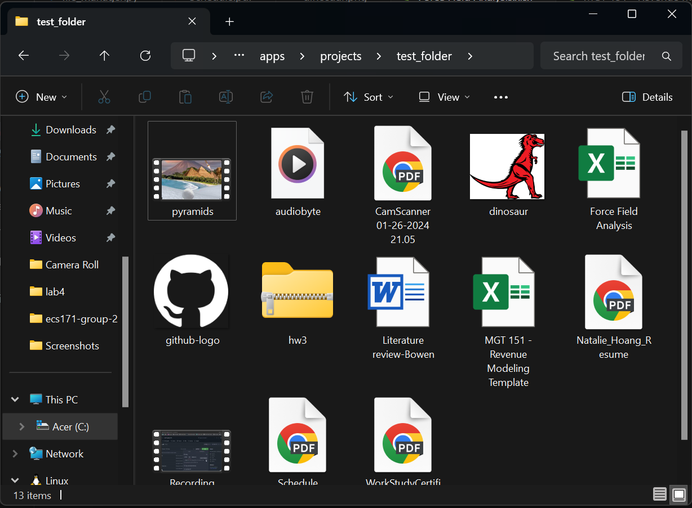
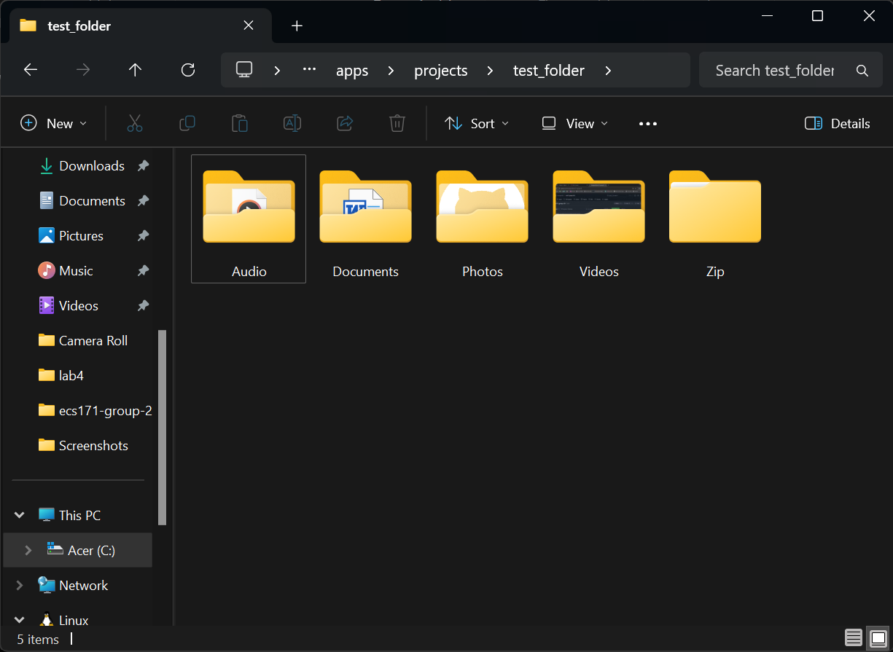

# File Manager
Organize your cluttered folders in seconds with this file manager! 
Just input the path to whichever directory you would like to organize, and each file will be sorted into subfolders based on their file type.

## Supported File Types: 
Documents: `.pdf`, `.docx`, `.doc`, `.xlsx`, `.xls`, `.ppt`, `.pptx`  
Photos: `.jpg`, `.jpeg`, `.png`, `.gif`  
Videos: `.mp4`, `.mmov`, `.wmv`  
Audio: `.mp3`, `.wav`  
Zip: `.zip`, `.tar`, `.gz`, `.rar`  

## How to Use
Install Python if you haven't already: https://www.python.org/downloads/
1. Download the script from this repo (file_manager.py)
2. Open up a terminal and navigate to the directory containing the script
3. Run the script using the command: `python file_manager.py`
4. When prompted, enter the path to the directory you would like to organize (e.g. C:\Users\username\projects)
5. Each file should now be organized according to their file type. Check out the directory to see your newly organized folder!

### Before: 

  

### After: 

  

## Requirements:
Python 3.x (preferably Python 3.6+)
The script uses the built-in os and shutil modules, so no external libraries are required.
